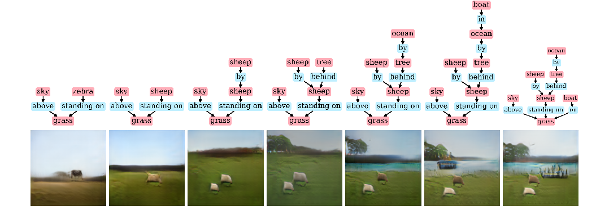

# Sg2im Web Demo

This is my attempt at making a web based demo of Google's [sg2im](https://github.com/google/sg2im), an end-to-end neural network model that converts a scene graph into a human recognizable image. My hope is to use their pretrained model to allow users to generate images themselves.

This web app will be built with React.js and Flask. My hope is that users can input potential objects (ie. sky, grass, shape) and their orders of relation so that they can create realistic images from the pre-trained model on the fly.

From [their paper](https://arxiv.org/abs/1804.01622) this is a visual example of how it works:



## Things to do

1. Use React components to save users objects and orders of relation (Done)
    * Function to save objects inputed from user to global scene graph ✔️
    * Function to add new objection relation rule components ✔️
    * Save object relations to global scene graph state ✔️
2. Write a Flask endpoint to receive scene graphs from React front end & write Ajax function to pass info (In Progress)
    * Rewrite some of the sg2im Python functions for better handling  ✔️
    * Create Flask endpoint to receive JSON data via Ajax ✔️
    * Write Ajax function to pass scene graph generated by user to Flask  ✔️
3. Create handling function to receive image back and display it
    * Write Python function pass image back
    * Create component to wait and receive image to display to user

## Local demo instructions

```bash
git clone https://github.com/jtloong/sg2im-demo.git
cd sg2im-demo
npm start
```

## Relevant links for the project

* https://github.com/google/sg2im
* https://github.com/facebook/create-react-app
* https://medium.com/@ruthmpardee/passing-data-between-react-components-103ad82ebd17
* https://github.com/JedWatson/react-select
* https://testdriven.io/asynchronous-tasks-with-flask-and-redis-queue
* https://stackoverflow.com/questions/22565808/run-django-and-node-in-a-heroku-app-simultaneously
* https://blog.heroku.com/heroku-django-node
* http://www.flaskapi.org/api-guide/status-codes/
